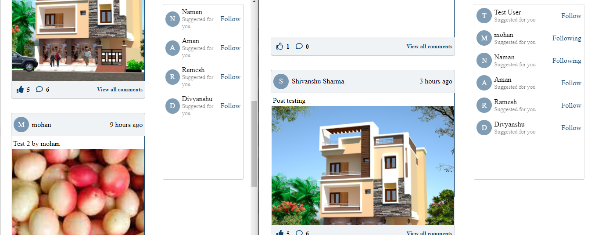
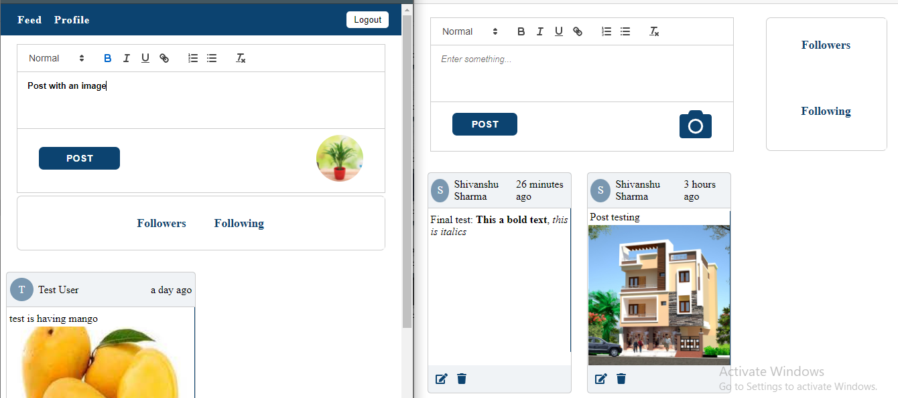
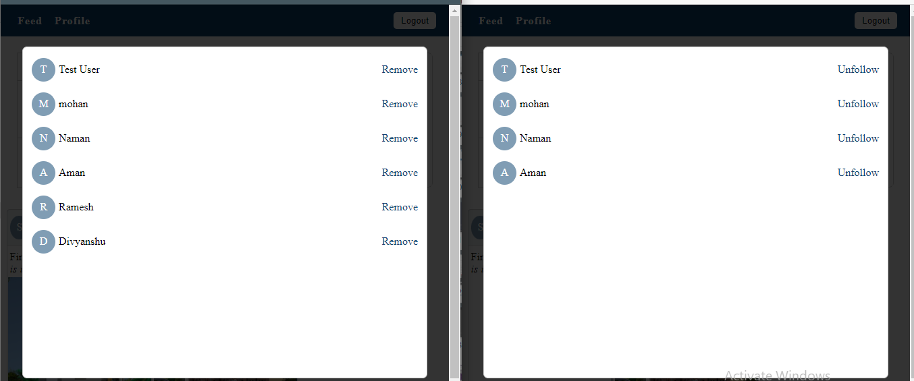
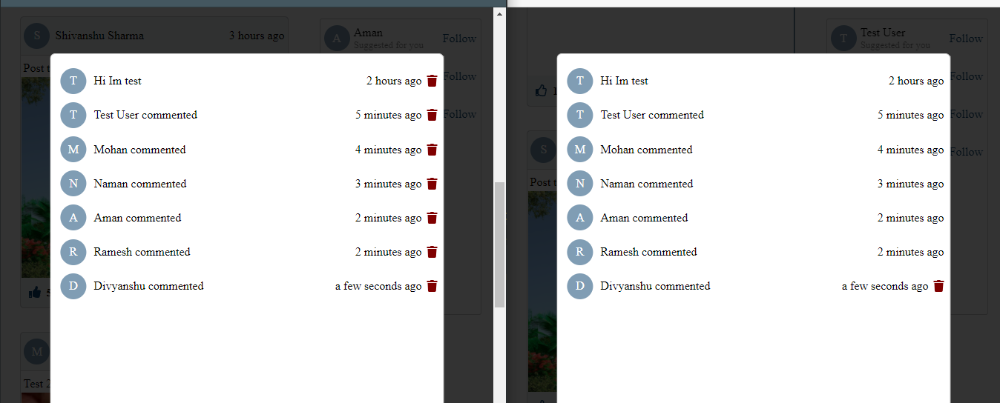
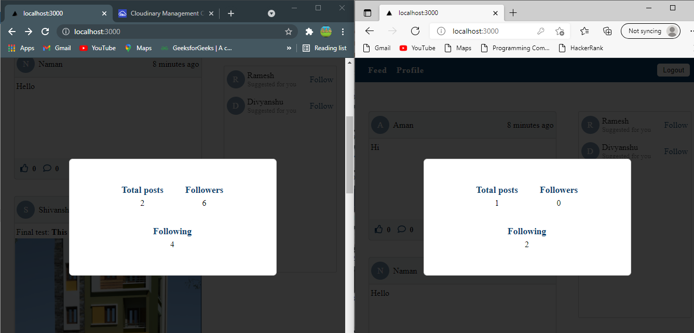

# Weshare

## Overview

A photo sharing app having a bunch of features as there are in social media apps

## Features

- User registration
- Create, edit and delete post (including image upload)
- Follow / unfollow other users
- Like / unlike the posts
- Comment on the posts (and delete)

## API

Api is created with Node.js and Express.js and images are stored in cloudinary [Repo Link](https://github.com/shivanshu2000/weshare-api)

## Here are some screenshots:

 feed page where users can like, comment and follow other users:

    
 

 

 profile page where users can create(with react-quill editor), edit and delete their posts:

    
 

 

 in profile page, users can unfollow the users and also remove the users from their followers list:

    
 

 

 users can comment on the posts and also delete the comments which are either on their own post or the ones they created on the other users posts:

    
 

 

 on the feed page users can see the details of other users by clicking on the avatar icon

    
 

